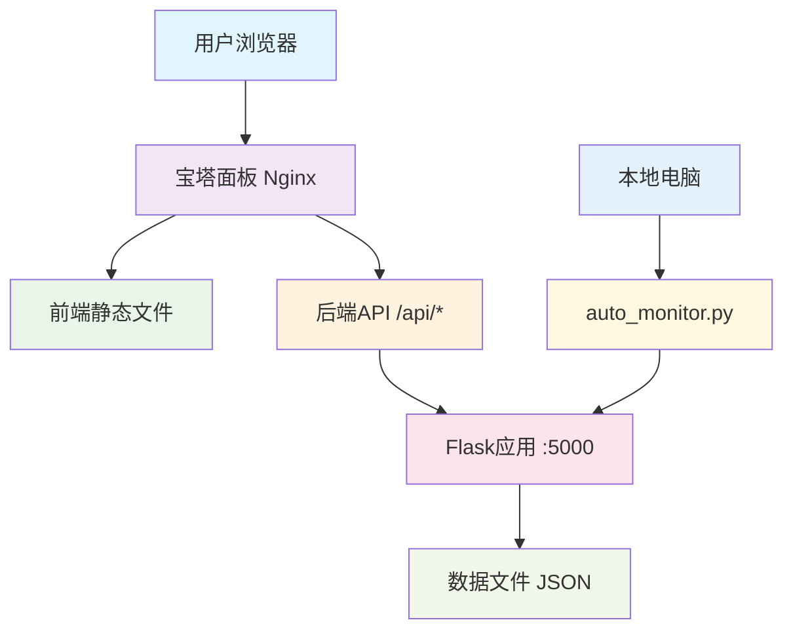

# 🎉 生日网站部署流程总结

## 📋 快速部署指南

### 🔍 您的项目结构
```
LinLu/
├── birthday-website/     # 前端 (Nuxt.js)
├── sleepy-status/       # 后端 (Flask API)
├── 宝塔面板部署指南.md    # 详细部署步骤
├── 部署脚本.bat          # 一键构建工具
└── 部署前检查.bat        # 环境检查工具
```

### 🎯 部署架构说明



## 🚀 三步部署法

### 第1步：本地准备 (5分钟)
1. 双击运行 `部署前检查.bat`
2. 双击运行 `部署脚本.bat`
3. 获得 `部署包_时间戳.zip`

### 第2步：服务器部署 (10分钟)
1. 上传部署包到服务器
2. 在宝塔面板创建网站和Python应用
3. 配置Nginx反向代理

### 第3步：本地监控 (2分钟)
1. 修改 `auto_monitor.py` 中的API地址
2. 运行本地监控程序

## 📚 详细文档参考

| 文档名称 | 用途 |
|---------|------|
| `宝塔面板部署指南.md` | 完整的部署步骤 |
| `部署前检查.bat` | 检查环境是否就绪 |
| `部署脚本.bat` | 一键构建部署包 |
| `部署流程总结.md` | 本文档 |

## ⚠️ 重要提醒

### 必须修改的配置
1. **域名配置**: 修改 `birthday-website/composables/useApi.js` 中的域名
   ```javascript
   ? 'https://your-domain.com/api'  // 改为您的域名
   ```

2. **本地监控**: 修改 `sleepy-status/auto_monitor.py` 中的API地址
   ```python
   API_URL = 'https://your-domain.com/api'  # 改为您的域名
   ```

### 宝塔面板必装组件
- ✅ Nginx (网站服务)
- ✅ Python 3.8+ (后端运行)
- ✅ Node.js 18+ (前端构建)

## 🔧 常见问题解决

### 1. 前端无法访问API
**原因**: 跨域或API地址配置错误
**解决**: 检查Nginx反向代理配置和域名设置

### 2. 状态不更新
**原因**: 本地监控程序未运行
**解决**: 确保 `auto_monitor.py` 在本地电脑运行

### 3. 构建失败
**原因**: 依赖问题或环境不兼容
**解决**: 运行 `部署前检查.bat` 修复环境问题

### 4. 宝塔面板Python应用启动失败
**原因**: 依赖未安装或端口冲突
**解决**: 在服务器终端运行 `pip install -r requirements.txt`

## 🎯 测试清单

部署完成后，请测试以下功能：

- [ ] 网站能正常访问 (`https://your-domain.com`)
- [ ] API接口响应正常 (`https://your-domain.com/api/status`)
- [ ] 状态页面显示正常 (`https://your-domain.com/api/status_page`)
- [ ] 本地监控程序运行正常
- [ ] 状态能够实时同步到网站

## 🏆 部署完成标志

当您看到以下情况时，说明部署成功：
1. 网站能够正常访问并显示生日内容
2. 状态卡片显示当前状态
3. 本地改变应用程序后，网站状态会更新
4. 时间轴显示历史记录

## 💡 后续维护

### 日常维护
- 定期检查服务器状态
- 保持本地监控程序运行
- 及时更新SSL证书

### 功能扩展
- 添加更多状态类型
- 完善移动端支持
- 增加数据可视化

---

🎉 **恭喜！按照本指南，您的生日网站将成功部署！**

如有问题，请参考 `宝塔面板部署指南.md` 获取更详细的解决方案。 